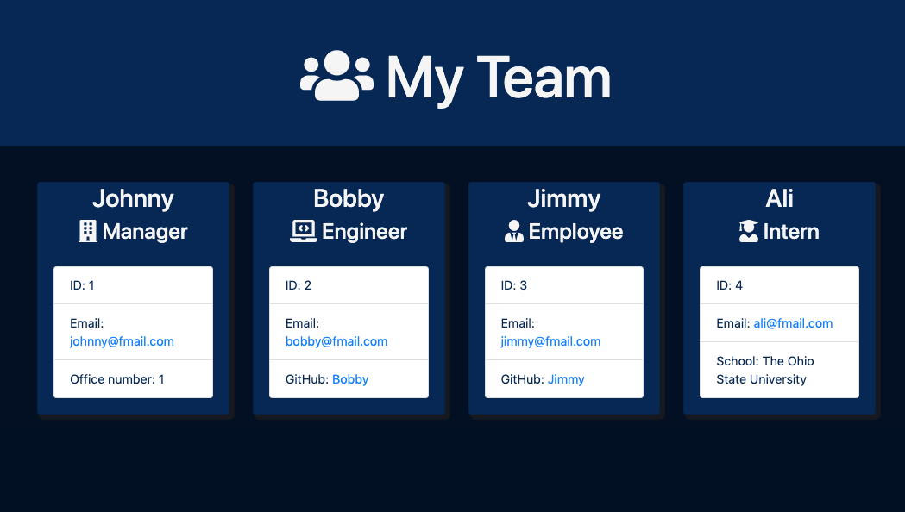

# OOP_TeamProfileGenerator

## Description

10 Object-Oriented Programming: Team Profile Generator

This is a `Node.js` command-line application that takes in information about employees on a software engineering team, then generates an HTML webpage that displays summaries for each person. A unit test was written for every part of the code and ensure that it passes each test.

Link to GitHub repository: [Team Profile Generator](/)

Link to walkthrough video: [TPG demo Video](/)


# Table of Contents
* [User Story](#user-story)
* [Mock Up](#mock-up)
* [Demo](#demo)
* [Acceptance Criteria](#acceptance-criteria)
* [Installation](#installation)
* [Usage](#usage)
* [Demo](#demo)
* [Directory Structure](#directory-structure)
* [Tests](#tests)
* [Grading Requirements](#grading-requirements)
* [Submitted for Review](#submitted-for-review)
* [Questions](#questions)
* [License](#license)


## User Story

```md
AS A manager
I WANT to generate a webpage that displays my team's basic info
SO THAT I have quick access to their emails and GitHub profiles
```

## Mock Up

The following image shows a mock-up of the generated HTML’s appearance and functionality. HTML webpage titled “My Team” features five boxes listing employee names, titles, and other key info 
<br>




## Demo

Link to walkthrough video demosonstrating the functionality of the `Team Profile Generator` and all tests passing: [Team Profile Generator Demo](/)

* The walkthrough video shows all four tests passing from the command line.
* The walkthrough video demonstrate how a user would invoke the application from the command line.
* The walkthrough video demonstrates how a user would enter responses to all of the prompts in the application.
* The walkthrough video demonstrates a generated HTML file that matches the user input.

## Acceptance Criteria

```md
GIVEN a command-line application that accepts user input
WHEN I am prompted for my team members and their information
THEN an HTML file is generated that displays a nicely formatted team roster based on user input
WHEN I click on an email address in the HTML
THEN my default email program opens and populates the TO field of the email with the address
WHEN I click on the GitHub username
THEN that GitHub profile opens in a new tab
WHEN I start the application
THEN I am prompted to enter the team manager’s name, employee ID, email address, and office number
WHEN I enter the team manager’s name, employee ID, email address, and office number
THEN I am presented with a menu with the option to add an engineer or an intern or to finish building my team
WHEN I select the engineer option
THEN I am prompted to enter the engineer’s name, ID, email, and GitHub username, and I am taken back to the menu
WHEN I select the intern option
THEN I am prompted to enter the intern’s name, ID, email, and school, and I am taken back to the menu
WHEN I decide to finish building my team
THEN I exit the application, and the HTML is generated
```

## Installation

Open `terminal` window after fork. `npm init -y` to create a package.son file to store your dependenices.

npm i to install your NPM package manager and required dependencies.

npm i `inquirer` to interact with the user via the command-line.

npm i `figlet` to implement FIGfont spec in Javascript.

npm i `chalk` for terminal string styling of Logo.

npm i [Jest](https://www.npmjs.com/package/jest) for running user tests for command prompts. 

## Usage

* Invoke the application by using the following command: `node index.js`

* With the application invoked, you'll be prompted to answer a series of questions from the command line to generate a `Team Profile` for your project.

* Each question will pertain to a specific `Team Member's Profile` you're creating. Answer each prompt for `Manager`, `Engineer`, `Intern`,  `Employee`. 

* Hit Enter after answering each question to continue to the next prompt. When all the prompts are completed, you will receive an alert `Team Profile Generator Complete`.

* A `sample.html` file will automatically generate inside the explorer window of your project directory within the `sample` folder.

* Your `sample.html` should contain a similar structure as the [#mock-up] shown above with a header displaying `my team`  and four individual cards for each `employee`. 

* Each employee card will have a `name`, `role`, & `email`. Engineer cards will include a `github username`. Intern cards will display the `school` which they are currently attending.  

* Please feel free to make changes to the styling or employee roles as needed, but do not make changes to the html file structure or javascript files unless you'd like to make a contribution. 

## Directory Structure

```md
__tests__/			// jest tests
  Employee.test.js
  Engineer.test.js
  Intern.test.js
  Manager.test.js
dist/               // rendered output (HTML) and CSS style sheet
lib/				// classes
src/				// template helper code
index.js			// runs the application
```

The application includes `Employee`, `Manager`, `Engineer`, and `Intern` classes. 

`Employee` parent class with the following properties and methods:

* `name`, `id`, `email`, `getName()`, `getId()`,`getEmail()`

* `getRole()`&mdash;returns `'Employee'`

The other three classes extend `Employee`.

`Employee`'s properties and methods, `Manager` have the following:

* `officeNumber`

* `getRole()`&mdash;overridden to return `'Manager'`

`Employee`'s properties and methods, `Engineer` have the following:

* `github`&mdash;GitHub username

* `getGithub()`

* `getRole()`&mdash;overridden to return `'Engineer'`

`Employee`'s properties and methods, `Intern` have the following:

* `school`

* `getSchool()`

* `getRole()`&mdash;overridden to return `'Intern'`

## Tests

* Using the [Jest package](https://www.npmjs.com/package/jest) for a suite of unit tests.

* The following tests for `Employee`, `Manager`, `Engineer`, and `Intern` classes (in the `_tests_` directory) ALL pass. 


```
Manager Test:
  test("Set Office Number from constructor", () => {
  const testValue = 0;
  const emp = new Manager("Johnny", 0, "johnny@fmail.com", testValue);
  expect(emp.officeNumber).toBe(testValue);
  });

Engineer Test:
  test("Set Office Number from constructor", () => {
  const testValue = 0;
  const emp = new Manager("Johnny", 0, "johnny@fmail.com", testValue);
  expect(emp.officeNumber).toBe(testValue);
  });

Employee Test:
  test("new Employee created", () => {
  const emp = new Employee();
  expect(typeof(emp)).toBe("object");
  });

Intern Test:
  test("get school from constructor", () => {
  const testValue = "The Ohio State University";
  const emp = new Intern("Ali", 4, "ali@fmail.com", testValue);
  });

```

## Grading Requirements
* Deliverables: 15%
* Walkthrough Video: 32%
* Technical Acceptance Criteria: 40%
* Repository Quality: 13%

## Submitted for Review

* A walkthrough video that demonstrates the functionality of the application and passing tests.
* A sample HTML file generated using your application.
* The URL of the GitHub repository, with a unique name and a readme describing the project.

## Questions
 
 Email: <a href="mailto:rdevans87@gmail.com">rdevans87@gmail.com</a>

 Github: <a href="https://github.com/rdevans87">rdevans87</a>


## License

[MIT License](LICENSE)

